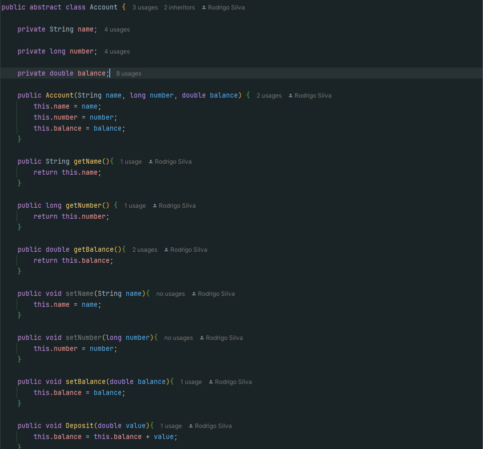

# AJX BANK

This application was created to apply the object-oriented programming (OOP) using Bank context.

## 4 Key Concepts of OOP 

* Abstraction
* Encapsulation
* Inheritance
* Polymorphism

### Abstraction

Abstraction allows you to hide complex implementation details and expose only essential functionality.
- The abstract class `Account` is a clear example of abstraction. It defines common features and behaviors (name, account number, balance, deposit and withdrawal methods) that all bank accounts should have, but without directly implementing specific features, such as fees or withdrawal limits.
- `CheckingAccount` and `SavingsAccount` are specializations that use the abstract behaviors of `Account` while implementing their own details.

### Encapsulation

Encapsulation protects data from unauthorized access by allowing controlled access through public methods.

In the application:

- Attributes such as `name`, `number`, and `balance` are private. They can only be accessed or modified through `get` and `set` methods.

- This ensures control and validation, protecting data from inconsistencies.

### Inheritance

Inheritance allows classes to share behaviors and attributes of a base class, promoting code reuse.

In the application:

- `CheckingAccount` and `SavingsAccount` inherit from `Account`.
- They reuse methods such as `Deposit` and `Withdraw` defined in `Account` and extend them with specific functionality, such as applying fees or withdrawal limits.

### Polymorphism

Polymorphism allows objects from different derived classes to be treated uniformly, while maintaining specific behaviors.

In the application:

- The `showInfo` method is overridden in `SavingsAccount` to display additional information, such as available withdrawals.
- The `Withdraw` method is also overridden in `SavingsAccount` to implement specific rules (checking for available withdrawals).

